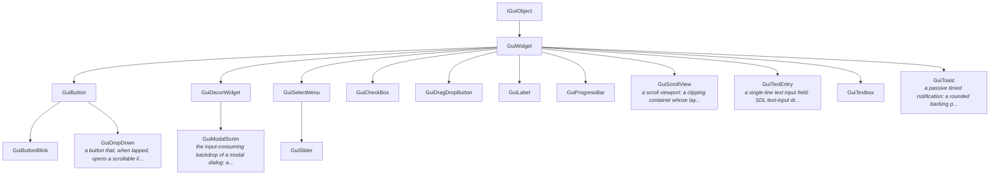

# The runtime GUI (`engine_gui`)

The game UI system. It renders through the `DrawLayer2D` facade, so it draws the
SAME image on both render flavors (classic OGRE and Ogre-Next) and on desktop and
mobile. Widgets are authored from Lua (`GuiFactory`) or declaratively from a
`.oui` text file (`GuiFactory::loadLayout`), and an AI agent drives and inspects
the live UI over MCP.

Two objects do the work:

- **`GuiManager`** (a singleton) owns the views/atlases, the input routing, the
  modal stack, toggle groups and toasts. In Lua this is the `gui` object.
- **`GuiFactory`** builds widgets (`createButton`, `createCheckBox`, …) and loads
  `.oui` layouts. In Lua this is the `factory` object.

```lua
factory = GuiFactory()
gui = GuiManager(factory, "gui_default", PROJECT_RESOURCE_GROUP)
gui:enableInputEvents()
local ok = factory:createButton("play", "button", 9, "Play",
    Vector2(40, 40), 0, Vector2(200, 48), "", 2, false, 0)
```

Atlases (`<name>.ogui` + `<name>.png`, or a runtime-baked TTF/SVG `.ogui`) are
generated by `Util/make_gui_atlas.py`. Visibility rides the shared per-z
`UiLayer`: `widget:getLayer():hide()/show()/isVisible()` toggles a whole layer at
once.

## Build a screen (the canonical recipe)

1. **Author** a `.oui` text layout (grammar below) — or `write_project_file` it
   over MCP.
2. **Load** it: `factory:loadLayout("screens/pause.oui")` (or `gui:loadLayout`).
3. **Find** each widget by id: `local btn = gui:findWidget("resume")` (nil if
   absent).
4. **Wire** behavior each frame: `if btn:wasClicked() then ... end`.
5. **Verify**: read back `get_ui_layout` over MCP (per-widget pixel rects + the
   visible/enabled/modal flags) and cross-check against `get_safe_area`.

**Poll idiom is single-consumer (latch-and-clear).** `wasClicked`/`wasSubmitted`/
`pollChanged`/`getDialogResult` return a pending event ONCE and clear it. With
several script components on one object, the FIRST to poll a widget consumes the
event; a later script sees nothing. **Convention: exactly one script owns a given
widget's events** — split UI ownership by widget, never have two scripts race for
the same button (see the script-component note in `lua-api.md`).

## Screen flow (the `screens` router)

A game is a handful of full-screen pages — a title, a level-select, a settings
page, the in-game HUD — and moving between them. The `screens` table is that
router: **one `.oui` per screen, then `screens.push`**. It turns navigation
from hand-wiring show/hide into a declaration.

```lua
function init(self)
    screens.define("title",    "screens/title.oui")     -- a .oui-backed screen
    screens.define("settings", "screens/settings.oui")
    screens.defineBuilder("hud", function()             -- or a code-built screen
        factory:loadLayout("screens/hud.oui")
        -- ...any imperative widget wiring for this screen...
    end)
    screens.push("title")                               -- the first screen
end
```

Then navigate from anywhere — a button poll, a game event:

```lua
if playBtn:wasClicked() then screens.push("hud") end      -- cover with a new screen
if settingsBtn:wasClicked() then screens.push("settings") end
if backBtn:wasClicked() then screens.pop() end            -- back to the one beneath
screens.replace("gameover")                               -- swap the top, same depth
local where = screens.current()                           -- "" when none is up
```

**Lifecycle — destroy-on-navigation, the `.oui` is the source of truth.** Only
the top screen is materialized. A `push` plays the current screen's **exit
transition**, tears its widgets down, then builds the new screen and plays its
**enter transition**; a `pop` reverses it, rebuilding the revealed screen from
its `.oui`/builder. Transitions come from each widget's own
[`transition`](#show--hide-transitions) spec (`fade`, `slide-up`, `pop`, …), so
screens fade/slide in and out for free. The router is **sequential** (the
outgoing screen finishes leaving before the incoming one builds), so screen
widget ids need not be unique across screens, and **transient widget state is
not preserved across navigation** — a screen is cheap to rebuild, so rebuild it.
Modals (`gui:showConfirm`/`showModal`) ride **above** the stack and are
unaffected by screen navigation.

**Back / Escape.** With a screen stack in play, the Android back button and
desktop Escape **pop the stack** by default (but never past the root screen —
there a back falls through, so Android backgrounds the app). A screen owns the
back gesture by installing a handler; while one is installed the default pop is
suppressed and the handler decides (pop, show a confirm, or ignore):

```lua
screens.setBackHandler(function()
    gui:showConfirm("Quit?", "Leave the level?", "Quit", "Stay")
    -- resolve the confirm elsewhere; call screens.pop() when the user confirms
end)
```

The handler resets on every navigation, so each screen opts in fresh.

**Readback (agents).** `get_ui_layout` carries the router state alongside the
widget rects: `screen` (the current top) and `screenStack` (the space-joined
bottom-to-top path). Drive it over MCP with `screens.push`/`pop` from a
`ScriptComponent` and assert the path.

## `.oui` grammar cheat-sheet

An ordered list of `[Type id]` sections, each a block of `key = value` lines
(`#` comments, LF endings, no scripting — parses in `ORKIGE_SCRIPTING=OFF`).

| Form | Meaning |
|---|---|
| `[Layout]` | optional global section (first) |
| `atlas = gui_default` | default atlas for widgets that omit one |
| `design = 1280 720 0.5` | design resolution W H + match factor (drives scale) |
| `root = fullwindow` \| `safearea` | layout root rect |
| `[Type id]` | a widget; `Type` ∈ the widget-type list below |
| `z = 2` | draw layer (painter order; higher = front) |
| `sprite = button` \| `none` | atlas sprite; `none` on a decor = solid fill |
| `font = 9` | glyph/font index |
| `text = Play` \| `@key` | caption; leading `@` = `StringTable` lookup |
| `position = 40 40` / `size = 200 48` | fixed pixel placement |
| `textAlignment = topleft` | text anchor within the rect |
| `enabled = false` | input-inert + dimmed (default true) |
| `parent = panelId` | rect-anchor layout parent |
| `anchor = center` | anchor preset (or `anchorMin`/`anchorMax` pair) |
| `pivot = 0.5 0.5` | pivot within the rect |
| `offsets = l t r b` | edge offsets from the anchored rect |
| `anchoredPos = 0 0` / `sizeDelta = 460 460` | anchored position / size |
| `useSafeArea = true` | inset the rect by the device safe area |
| `group = vertical` \| `horizontal` \| `grid` | make this a layout container |
| `padding = l t r b` / `spacing = 10` | container spacing |
| `childAlign` / `childExpand` / `fit` | container child rules |
| `cellSize = w h` / `gridConstraint = n` | grid-group geometry |
| `nineSlice = true` \| `tiled = true` \| `color = r g b a` | decor draw modes |
| `items = A \| B \| C` | dropdown/select options (pipe-separated) |
| `transition = fade 0.2` | enter/exit transition (see Animation) |
| `modal = confirmId` | create on that modal's content layer + tear down with it |
| `[Modal id]` + `scrim = r g b a` / `lightDismiss = bool` | a modal scrim |
| `[ToggleGroup id]` + `members = a b c` / `selected` / `allowNone` | a radio group |

Widget `Type`s: `label`, `textbox`, `button`, `checkbox`, `selectmenu`,
`slider`, `progressbar`, `textentry`, `decorwidget` / `panel`, `scrollview`,
`dropdown`.

## Widget set

| Widget | Purpose | Key API (poll / set) |
|---|---|---|
| `GuiLabel` | one line of text | `setText` |
| `GuiTextbox` | multi-line markup text (`UiMarkupText`, wrapped) | `setText` |
| `GuiButton` | pressable button | `wasClicked` / `ButtonHitEvent`, `setPressFeedback` |
| `GuiCheckBox` | on/off toggle (may join a toggle group) | `isChecked` / `setChecked` |
| `GuiSelectMenu` | an option **cycler** (‹ value ›) | `getSelectedIndex` / `setItemsString` |
| `GuiDropDown` | an option **list** dropped on a modal | `getSelectedIndex` / `setItemsString` |
| `GuiSlider` | a dragged value over discrete items | `getSelectedItemIndex` / `setCaption` |
| `GuiProgressBar` | a fill bar with a caption | `setProgress` / `setCaption` |
| `GuiTextEntry` | single-line text field (focus, caret, max) | `getText` / `wasSubmitted` / `setText` |
| `GuiDecorWidget` | sprite panel OR (empty sprite) solid fill; nine-slice / tiled | `setColour` / `setAlpha` |
| `GuiScrollView` | a clipping viewport whose content scrolls | `setScroll` / `getScroll` / `getMaxScroll` |
| `GuiToast` | a passive, timed, self-dismissing notification | (built via `gui:showToast`) |
| `GuiModalScrim` | the consuming backdrop of a modal dialog | (built via `gui:showModal`) |

Common to every widget (`GuiWidget`): `setEnabled`/`isEnabled`, the rect-anchor
layout setters (`setParent`/`setAnchorPreset`/`setPivot`/`setOffsets`/…),
`setGroupAlpha`/`getEffectiveAlpha`, `setTransition`, and `getLayer()` for
per-layer visibility.

### Widget class hierarchy

<!-- GENERATED:gui-widget-tree - edit Util/update_docs.py / lua_api_annotations.json; do not hand-edit -->

<!-- /GENERATED:gui-widget-tree -->

## Input routing (the model to understand)

`GuiManager` **broadcasts** every input event to all widgets in z order,
**highest layer first**. Each widget hit-tests itself; there is **no
first-hit-wins consume** — overlapping widgets all see the same press. Two things
change that:

- A **disabled** widget (`setEnabled(false)`) is skipped by hit-testing
  entirely — the dispatch loop never calls its handlers, so it is input-inert —
  and rendered dimmed. Uniform for every widget type.
- A **modal scrim** (`GuiModalScrim`) sits on a high layer and, on any cursor
  event, calls `GuiManager::cancelCurrentInputUpdate()`. That stops the dispatch
  for every LOWER layer for the rest of that event. The dialog's own widgets sit
  one layer ABOVE the scrim, so they are dispatched first and still work, while
  everything beneath the scrim is eaten.

## Disabled state

```lua
button:setEnabled(false)   -- input-inert + dimmed (Button swaps to its
                           -- "_disabled" sprite; others dim to 50% alpha)
if button:isEnabled() then ... end
```

Disabling a container / panel disables its whole **subtree**: a widget is inert
when it OR any layout ancestor is disabled (the manager gates input on
`isEffectivelyEnabled`, which walks the layout-parent chain). In `.oui`, any
widget takes `enabled = false` (default true).

## Modal dialogs

A modal is a full-window consuming scrim on a fresh layer above everything, plus
the dialog widgets one layer above the scrim. Two convenience builders assemble a
whole dialog; both return the modal id and resolve via a poll.

```lua
local id = gui:showConfirm("Reset?", "Erase all settings?", "Yes", "No")
-- later, each frame:
local r = gui:getDialogResult(id)   -- 0 pending, 1 Yes/OK, 2 No
if r == 1 then doReset() end

gui:showAlert("Out of coins", "Earn more to buy this.", "OK")
```

Lower-level control:

```lua
local m = gui:showModal("pause", false)   -- (id, lightDismiss); bare scrim
local z = gui:getModalContentZ("pause")   -- author dialog widgets on this layer
gui:registerModalWidget("pause", "pauseTitle")  -- tear down with the modal
gui:dismissModal("pause")                 -- or gui:dismissTopModal()
if gui:isModalActive() then ... end
```

Established modal behavior, so instincts transfer:

- The scrim blocks ALL input on the layers below it; the dialog's own widgets sit
  one layer above and stay interactive.
- **Outside-tap dismiss is opt-in per dialog** (`lightDismiss`): `showConfirm` /
  `showAlert` default NOT light-dismissable (they must be answered by a button);
  menus and dropdowns ARE. A tap on the scrim of a light-dismissable modal closes
  it.
- **Escape** (desktop) and the **Android back button** dismiss the TOP modal, but
  only when it is light-dismissable — a confirm/alert is left up (answer it with a
  button). Either way the key is consumed while a modal is up.
- Modals **stack LIFO**: the newest is raised above the rest and wins input.
- **Focus transfers**: the text-entry input session focused below the stack is
  blurred while a modal is up (so typing never leaks past the scrim) and restored
  when the last modal closes.

Text with a leading `@` is looked up in the `StringTable` (localisation).

## Toggle groups (radio / single selection)

Radio semantics: exactly one member is selected; checking one unchecks the
others, and clicking the already-selected member does NOT deselect it (a group
never lands in an empty state unless you opt in). The pure state machine is
`core_util/ToggleGroupState`.

```lua
local group = gui:createToggleGroup("quality")
group:addMember(low)      -- three GuiCheckBox widgets
group:addMember(medium)
group:addMember(high)
group:setSelected(0)
-- each frame:
if group:pollChanged() then applyQuality(group:getSelected()) end
```

`group:setAllowNone(true)` (default off) opts into switch-off: tapping the
selected member then deselects it, allowing the empty state.

## Toasts

A timed, self-dismissing notification. It is **non-interactive** and never blocks
input. Toasts **queue FIFO with one visible at a time** (the common mobile
convention); the default lifetime is ~2.5 s. The pure `core_util/ToastQueue`
sequences and fades them.

```lua
gui:showToast("Saved", 2.5)   -- text, seconds
```

## Animation & juice

Widgets animate through the same `TweenManager` the game tweens ride (ticked in
the player loop; dormant in the editor, so animation never runs in edit mode).
The Lua surface is the **`guitween`** table — one call per property, keyed by
widget id:

```lua
guitween.alpha(id, alpha, duration [, ease [, delay [, onComplete]]])
guitween.scale(id, scale, duration [, ...])    -- uniform scale about the centre
guitween.rotate(id, degrees, duration [, ...]) -- Z rotation about the centre
guitween.move(id, x, y, duration [, ...])      -- anchoredPosition (layout) / position
guitween.size(id, w, h, duration [, ...])      -- sizeDelta (layout) / size
guitween.color(id, r, g, b, a, duration [, ...]) -- decor tint (decor widgets)
guitween.show(id) / guitween.hide(id)          -- play the widget's transition
guitween.stop(id)                              -- cancel every tween on the widget
```

The default ease is ease-out quadratic (`quadOut`); pass any
[`EaseLibrary`](../orkige_core/core_tween/EaseLibrary.h) name. Every call returns
a handle:

```lua
local h = guitween.scale("badge", 1.2, 0.3, "quadInOut")
h:setLoops(-1, true)   -- loop forever, ping-pong (back and forth); count<0 = infinite
if not h:isActive() then ... end   -- the completion poll
h:cancel()
```

Completion resolves BOTH ways, matching how confirm dialogs do: poll
`handle:isActive()`, or pass an `onComplete` callback as the trailing argument.

**Semantics (the conventions to rely on):**

- **Replace-on-retarget (last-wins).** Starting a tween on a property that is
  already animating on that widget cancels the running one — the newest target
  wins. There is at most one tween per (widget, property).
- **Auto-kill on destroy.** Destroying a widget stops its animations; a tween
  never writes to a widget that no longer exists (the apply re-fetches by id).
- **Compose with layout, don't fight it.** Animating a layout-driven widget
  tweens its LAYOUT INPUTS — `move` drives `anchoredPosition`, `size` drives
  `sizeDelta` — so the resolver and the animation cooperate. `scale` and
  `rotate` are a render transform about the widget centre, layered on top of the
  resolved rect (the layout geometry never changes).
- **The batch stays one draw.** Scale/rotation transform the emitted vertices in
  place; an animating widget resubmits its screen but rebuilds no geometry.

### Cascading (group) alpha

`widget:setGroupAlpha(a)` sets a 0..1 opacity that **multiplies down the
layout-parent chain**: fading a panel dims every widget parented under it,
multiplicatively through nesting. `widget:getEffectiveAlpha()` reads the
resolved product. Below a small threshold the faded-out subtree also stops
hit-testing (input falls through to whatever is behind it) — the standard
convention; opt out per widget with `widget:setAlphaBlocksInput(false)`.

### Show / hide transitions

Widgets carry an enter/exit transition, declared in `.oui` or set from Lua:

```
[Panel menu]
transition = fade 0.2        # or "slide-up 0.3", "slide-down", "slide-left",
                             # "slide-right", "pop", "none"
```

```lua
panel:setTransition("pop 0.25")
guitween.show("menu")    -- plays the enter transition (fade in / slide in / pop up)
guitween.hide("menu")    -- plays the exit (reverse) THEN parks the widget hidden
```

The exit reverses the enter (fade out, slide back out the way it came, pop
down); a `hide` ends the widget at effective-invisible so it stops drawing AND
hit-testing. A widget with `transition = none` (or unset) snaps.

### Button press feedback

`button:setPressFeedback(true)` opts a button into the tactile "juice": it
scales down a touch on press and springs back with a slight overshoot on release
(a short `backOut` scale tween through the same path).

### Scroll momentum

`GuiScrollView` flicks: releasing a drag with velocity coasts with exponential
deceleration; dragging past an edge rubber-bands (diminishing resistance) and
springs back on release; the mouse wheel bypasses momentum (discrete, not a
flick). The feel is the pure
[`ScrollMomentum`](../orkige_core/core_util/ScrollMomentum.h) state machine,
unit-tested headlessly.

The matrix selfcheck (`demo_gui_matrix`, both flavors) builds every widget type
from `.oui` AND imperatively, drives each with synthetic input, and asserts its
state/geometry plus this whole animation layer.

## Performance contract

Mobile is the target, so the renderer keeps a hard promise, made **enforceable**
by the `demo_gui_matrix` selfcheck (both flavors):

- **One draw per screen per atlas.** Every visible layer of one atlas
  concatenates into a single `DrawLayer2D` batch. A modal (scrim + dialog) shares
  its atlas' batch (still 1); only a scissored scroll region adds one (→ 2); a
  second atlas adds one screen (→ +1). Probe: `gui:getLastBatchCount()`.
- **Dirty-tracked.** A fully static screen resubmits nothing; one content change
  resubmits exactly once; an animation resubmits each active frame and stops the
  frame it completes. Probe: `gui:getRebuildCount()` (batch resubmits, read
  deltas). An unfocused widget must never dirty per frame.
- **Transform-only animation rebuilds no geometry.** A scale/rotation/alpha
  animation rides as a per-frame post-pass on the cached vertices, so it
  RESUBMITS the batch but re-tessellates nothing. Probe:
  `gui:getGeometryRebuildCount()` — flat while a transform animates, +1 per real
  content change (a text/sprite edit). This distinction is the point of the
  post-pass transform design.
- **Zero steady-state allocation.** The retained scratch buffer keeps its
  capacity across identical rebuilt frames (no per-frame reallocation). Probe:
  `gui:getScratchCapacity()`, stable after warmup.

`gui:profileTick(dt)` runs the whole gui frame (layout resolve + tween tick +
rebuild + submit) off the event bus so a selfcheck can time it; the matrix logs
µs/frame for a settings-scale screen and a 200-widget stress.

## Fully scriptable

Every gui capability — creation of all widget types, every setter/getter
(anchors/pivots/offsets/groups/fit, enabled, nine-slice/tiled, group alpha,
render scale/rotation, transitions), modals (show/dismiss/confirm/alert/dialog
results), toggle groups, dropdown items (`setItemsString`) + selection, toast,
scroll offsets, `loadLayout`, and the `guitween` surface — is reachable from a
`ScriptComponent`. Widgets authored in a `.oui` are found from Lua by id with
`gui:findWidget(id)` (nil when absent), the bridge that lets a script wire
behavior onto a declaratively-authored screen. The guarantee is enforced by
construction: the `demo_gui_lua` selfcheck authors, drives and asserts the whole
matrix **in Lua**, so a missing/renamed binding fails the suite rather than
review.

## Dropdown vs. cycler

`GuiSelectMenu` is a compact cycler (‹ value ›) — best for short option sets.
`GuiDropDown` drops a scrollable list on a light-dismiss modal — best for long
lists. Both share the value API. The dropdown follows the established combobox
behavior: it **opens on press**, the list **overlays** the content (it does not
push it), the **currently-selected option is highlighted**, the list **scrolls**
when it is long, and it **closes on pick, on an outside tap, or on Escape**.

```lua
local dd = factory:createDropDown("lang", "button", 9, "English",
    Vector2(40, 300), 0, Vector2(220, 44), "", 2)
-- from Lua, set the options with a pipe-delimited string (setItemsString); the
-- vector-taking setItems is the C++ face. GuiSelectMenu/GuiSlider share it.
dd:setItemsString("English | Deutsch | Français | 日本語")
-- each frame:
local i = dd:getSelectedIndex()
```

## `.oui` declarative layout

A `.oui` file is an ordered list of `[Type id]` sections, each a list of
`key = value` entries. It is pure text — no renderer, no scripting — so it parses
in the `ORKIGE_SCRIPTING=OFF` build and an agent authors it over the MCP
`write_project_file` verb. Load it with `factory:loadLayout("screen.oui")` at
runtime.

```
[Layout]                 # optional global section
atlas = gui_default      # default atlas for widgets that omit one
design = 1280 720 0.5    # design resolution + match factor (drives the scale)
root = fullwindow        # or "safearea"

[Button play]
z = 2
sprite = button
font = 9
text = Play              # a leading @ looks the value up in the StringTable
position = 40 40
size = 200 48
enabled = true
anchor = center          # rect-anchor layout (opt-in; see below)
```

### Common keys (any widget)

`atlas`, `z`, `sprite`, `font`, `text`, `position`, `size`, `textAlignment`,
`enabled`. Rect-anchor layout keys: `parent`, `anchor` (preset) or
`anchorMin`/`anchorMax`, `pivot`, `offsets`, `anchoredPos`, `sizeDelta`,
`useSafeArea`. Group keys (on a container): `group` (`horizontal`/`vertical`/
`grid`), `padding`, `spacing`, `childAlign`, `childExpand`, `cellSize`,
`gridConstraint`, `fit`. Decor draw modes: `nineSlice`, `tiled`, `color`.

### Widget types

`label`, `textbox`, `button`, `checkbox`, `selectmenu`, `slider`, `progressbar`,
`textentry`, `decorwidget` / `panel`, `scrollview`, `dropdown`.

A `dropdown` takes `items = A | B | C` (pipe-separated so labels may hold spaces).

### Modals in `.oui`

```
[Modal confirm]
scrim = 0 0 0 0.5        # backdrop tint r g b a (optional)
lightDismiss = false     # tap-outside-to-close (optional)

[Button confirmYes]
modal = confirm          # created on the modal's content layer + torn down with it
sprite = button
text = Yes
position = 300 320
size = 160 48
```

A widget with `modal = <id>` is created on that modal's content layer (above its
scrim) and freed when the modal is dismissed.

### Toggle groups in `.oui`

```
[ToggleGroup quality]
members = optLow optMed optHigh    # space-separated checkbox ids
selected = 1                       # optional
allowNone = false                  # optional
```

## Hot-reload during Play (`.oui` iteration)

Editing an `.oui` while a Play session runs updates the running game's screen
live — the same iteration loop `.lua` scripts have. On a file save the editor's
`.oui` watcher sends the fresh screen to the player, which **destroys that
screen's widgets and rebuilds them from the new file** (a CLEAN CUTOVER — no
state is merged; `GuiFactory` tracks which widgets/modals/toggle-groups each
loaded `.oui` produced and tears exactly those down). Trigger it three ways:

- **Save the file** in an external editor while Play runs (the editor watches the
  project tree for `*.oui`, same cadence/lifecycle as the `scripts/` watcher).
- **`reload_ui(file)`** over MCP (`file` is the name the game passed to
  `loadLayout`, e.g. `hud.oui`).
- Both funnel to the ONE `MSG_RELOAD_UI` player message, applied at the frame
  boundary (never mid-frame).

Contract:

- **A broken (unparseable) `.oui` keeps the OLD screen up** and reports the parse
  error to the editor Console as a `[remote]` line — a half-built screen never
  renders.
- **Script handles go stale.** A rebuild destroys the old widget objects, so any
  `woptr`/handle a script cached is dead. The player emits **`ui.reloaded {file}`**
  on the script event bus after a successful rebuild; subscribe in `init` and
  re-acquire handles with `gui:findWidget(id)`:

  ```lua
  function init(self)
      factory:loadLayout("hud.oui")
      self.score = gui:findWidget("scoreLabel")
      events.subscribe("ui.reloaded", function(e)
          if e.file == "hud.oui" then
              self.score = gui:findWidget("scoreLabel")  -- rebuilt: re-acquire
          end
      end)
  end
  ```

The editor never hot-reloads its own GUI Preview stage through this path (that
panel has its own refresh).

## MCP (agent control)

- `reload_ui` — hot-reload one `.oui` screen on the running game (destroy +
  rebuild from the fresh file); a parse failure keeps the old screen and surfaces
  a `[remote]` error, a rebuild emits `ui.reloaded {file}`. See "Hot-reload
  during Play" above.
- `get_ui_layout` — the running game's widgets: parallel `ids` / `rects` lists,
  each rect a flat `left top width height visible enabled modal` string (pixels;
  the three flags are `1`/`0`). Read `modal` to assert a dialog is up, `enabled`
  to assert a row is disabled.
- `gui_press` — synthesize a press on a widget by id, routed through the REAL
  input path, so modal/disabled semantics apply (a button under a scrim does NOT
  fire; a disabled widget stays inert).
- `dismiss_modal` — close a modal by id, or the topmost one.
- `preview_ui` — render a `.oui` screen at a SIMULATED device context (resolution
  + content scale + safe-area notch) into an offscreen target and return a
  screenshot + the resolved widget rects, **with no running player**. Single
  context via `width`/`height`/`scale`/`insets`, or a device-matrix sweep via
  `contexts`. The agent's half of the collaborative loop below.

## The GUI Preview tab (the collaborative design loop)

The editor's **GUI Preview** panel (View ▸ GUI Preview) renders a project screen
through the SAME real gui stack the game uses — an isolated instance, never the
running game's — into an offscreen target, at a simulated device you pick
(resolution presets phone/tablet/desktop + custom, content scale 1×/2×/3×, a
notch preset). It **watches the previewed `.oui`'s mtime and rebuilds on change**,
so an agent editing the file over MCP (`write_project_file`) is reflected live in
the human's tab. The optional widget-rect overlay outlines every resolved widget.

That is the loop: an agent authors a screen (`write_project_file`), `preview_ui`
screenshots it across device contexts and reads back the rects, a human watches
the tab update, both iterate on the one shared `.oui`. The preview needs offscreen
2D composition (a `DrawLayer2D` compositing into a `RenderTexture`), which is an
**Ogre-Next capability**; on the classic editor the tab shows a disabled note and
`preview_ui` returns an honest error (see `Docs/render-abstraction.md`).

See `Docs/mcp.md` for the full endpoint.

## Recipes

### Tabs

A horizontal button group plus one `UiLayer` per tab; show the picked tab's layer
and hide the rest.

```lua
local pages = { general = pageGeneralLayer, audio = pageAudioLayer }
local function showTab(name)
    for k, layer in pairs(pages) do layer:setVisible(k == name) end
end
-- in update: if tabAudio:wasClicked() then showTab("audio") end
```

### Show / hide transitions

Declare the transition and play it — see [Animation & juice](#animation--juice).

```lua
panel:setTransition("slide-up 0.3")
guitween.show("panel")   -- slide in
guitween.hide("panel")   -- slide back out, then park hidden
```

### Value-label binding

Slider / progress bar carry a caption; update it from the value each frame.

```lua
slider:setCaption(tostring(slider:getSelectedItemIndex()))
```

### Widget click sounds

Poll the click and play a UI sound (no engine hook needed):

```lua
if button:wasClicked() then sound:play("ui_click") end
```
